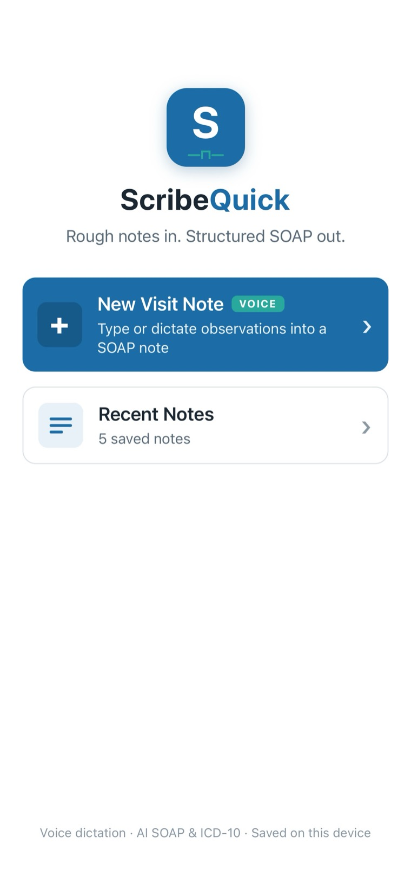
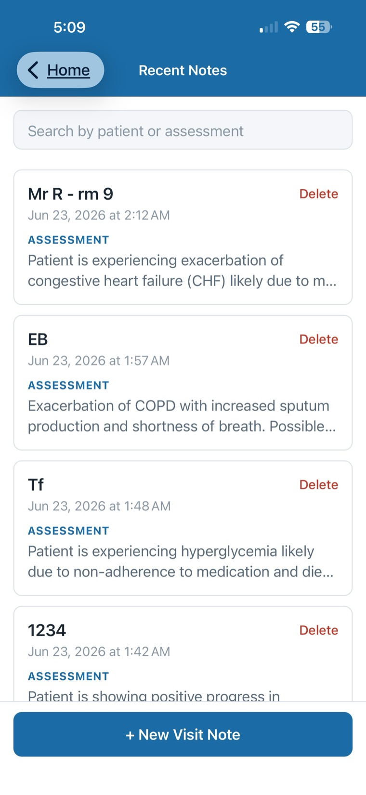
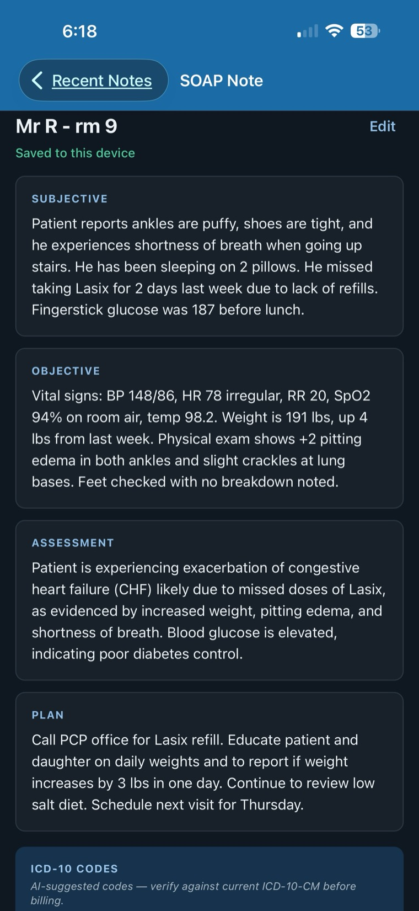
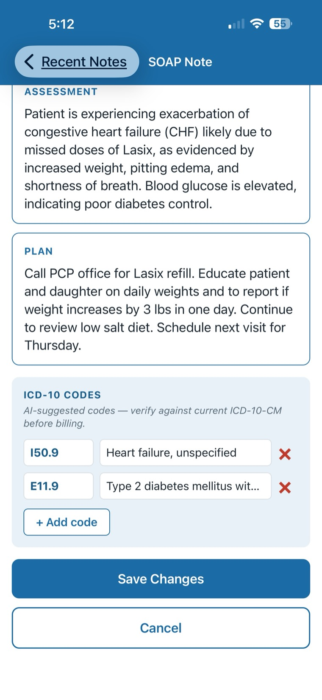
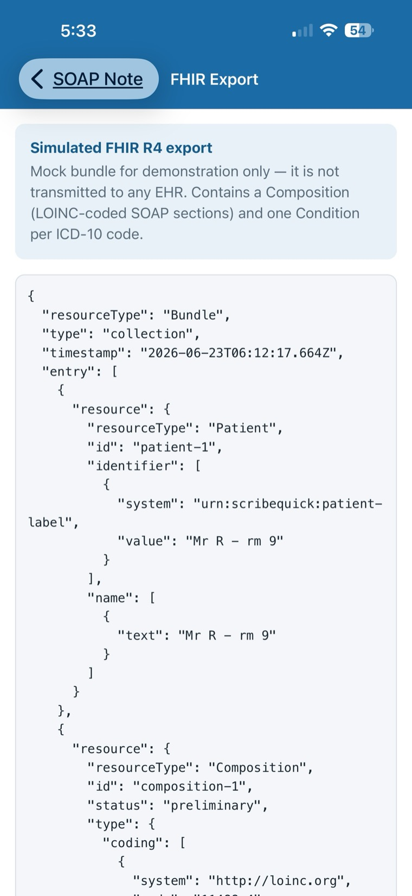

# ScribeQuick

**Rough notes in. Structured SOAP out.**

ScribeQuick is a React Native (Expo + TypeScript) mobile app that converts a home
health nurse's rough visit observations — typed or **spoken** — into a structured
SOAP note with suggested ICD-10-CM codes, using the OpenAI API.

It's a portfolio project built to demonstrate React Native engineering and
practical AI integration in a realistic clinical-documentation workflow.

> ⚠️ **Not a medical device.** ScribeQuick is a demonstration project. Its output
> is AI-generated and **not** clinically validated. Do not use it for real patient
> care or billing. All ICD-10 suggestions must be verified against current
> ICD-10-CM before use.

---

## Screenshots

<p align="center">
  <br/>
  <sub><b>Welcome</b> — type or dictate a visit note, or browse history</sub>
</p>

<table>
  <tr>
    <td align="center" width="25%">
      <br/>
      <sub><b>Recent notes</b><br/>searchable history</sub>
    </td>
    <td align="center" width="25%">
      <br/>
      <sub><b>SOAP note</b><br/>dark mode</sub>
    </td>
    <td align="center" width="25%">
      <br/>
      <sub><b>Edit before save</b><br/>ICD-10 codes</sub>
    </td>
    <td align="center" width="25%">
      <br/>
      <sub><b>FHIR export</b><br/>simulated R4 bundle</sub>
    </td>
  </tr>
</table>

---

## Features

- **Type or dictate** visit notes — voice input is recorded with `expo-audio` and
  transcribed via OpenAI Whisper.
- **AI SOAP generation** — `gpt-4o-mini` returns Subjective, Objective, Assessment,
  and Plan as strict JSON, validated before rendering.
- **ICD-10-CM coding assist** with several accuracy measures:
  - a coding-rules system prompt (highest specificity, laterality/site/severity,
    combination codes, no integral-symptom codes);
  - a per-code **coding rationale** the nurse can spot-check;
  - a deterministic cleanup pass that removes contradictory codes (e.g. drops the
    diabetes "without complications" code when a complication code is present).
- **Edit before saving** — review and correct the patient label, any SOAP
  section, or the ICD-10 codes before saving. Saved notes can be re-opened,
  edited, and updated in place.
- **Copy full note** to the clipboard as formatted plain text (with the billing
  disclaimer included).
- **Simulated FHIR export** — generate a standards-shaped FHIR R4 bundle
  (a Composition with LOINC-coded SOAP sections + one Condition per ICD-10 code)
  and copy it. Demonstration only; never transmitted to a real EHR.
- **Local history** — notes are saved on-device with AsyncStorage, searchable by
  patient label or assessment, with inline delete confirmation.
- **Branded UI** — a code-rendered logo wired into the app icon and splash screen.
- **Light & dark mode** — follows the OS appearance via a theme-aware palette;
  colors meet WCAG AA contrast in both modes, and interactive elements carry
  screen-reader labels and roles.

## Tech stack

- [Expo](https://expo.dev) (SDK 54) + [Expo Router](https://docs.expo.dev/router/introduction/) (file-based navigation)
- React Native + TypeScript (strict mode)
- [`expo-audio`](https://docs.expo.dev/versions/latest/sdk/audio/) for voice recording
- [`@react-native-async-storage/async-storage`](https://react-native-async-storage.github.io/async-storage/) for local persistence
- [`axios`](https://axios-http.com/) for HTTP, [`expo-clipboard`](https://docs.expo.dev/versions/latest/sdk/clipboard/) for copy
- OpenAI API — `gpt-4o-mini` (SOAP + ICD-10) and `whisper-1` (transcription)

## Project structure

```
app/                  # Expo Router screens
  _layout.tsx         # Stack navigator + shared header styling
  index.tsx           # Welcome screen (logo, tagline, entry points)
  new-note.tsx        # Input screen — type or dictate, then generate
  notes.tsx           # Recent Notes history (search + delete)
  results.tsx         # SOAP sections, ICD-10 list, rationale, copy/save
components/
  Logo.tsx            # Code-rendered brand mark (no image/SVG dependency)
  NoteCard.tsx        # Saved-note card for the history list
  SoapSection.tsx     # One labeled SOAP section
services/
  openai.ts           # ALL OpenAI logic (SOAP generation + Whisper)
  storage.ts          # ALL AsyncStorage logic
constants/
  theme.ts            # Single source of truth for colors/spacing/type
```

## Getting started

### Prerequisites

- Node.js 20.19.4+
- An [OpenAI API key](https://platform.openai.com/api-keys)
- The **Expo Go** app on your phone (iOS/Android), or a simulator/emulator

### 1. Install dependencies

```bash
npm install --legacy-peer-deps
```

> **Why `--legacy-peer-deps`?** The pinned Expo SDK 54 dependency set pulls in a
> `react-dom` whose peer range is stricter than the pinned `react` version. The
> legacy flag lets npm resolve it the way the Expo/React Native ecosystem expects.
> A plain `npm install` will fail with an `ERESOLVE` error.

### 2. Configure your API key

Create a `.env` file in the project root:

```bash
EXPO_PUBLIC_OPENAI_API_KEY=sk-your-key-here
```

`.env` is gitignored and must **never** be committed.

### 3. Run

```bash
npx expo start
```

Then scan the QR code with the **Camera app** (iOS) or the in-app scanner
(Android) to open it in Expo Go. `expo-audio` ships inside Expo Go, so voice input
works without a custom build.

## How the AI integration works

All API access is isolated in [`services/openai.ts`](services/openai.ts):

1. **Transcription (optional)** — a recording's local URI is uploaded to Whisper
   (`whisper-1`); the returned text is appended to the notes field.
2. **SOAP generation** — the rough notes are sent to `gpt-4o-mini` with
   `response_format: json_object` and a coding-rules system prompt. The JSON is
   parsed, every field is type-validated, and a `SoapParseError` (carrying the raw
   response) is thrown on any mismatch so the UI can show a fallback.
3. **Post-processing** — `sanitizeIcd10Codes()` deterministically removes
   duplicate and contradictory codes before the result reaches the UI.

## Testing

Unit tests cover the pure, high-risk logic with Jest (`jest-expo` preset):

```bash
npm test            # run once
npm run test:watch  # watch mode
```

The suite (`__tests__/`) exercises the SOAP response parser (valid JSON, code
fences, malformed/empty input, rationale normalization), the ICD-10 cleanup
rules (`sanitizeIcd10Codes`), and the FHIR bundle builder (resource shape, LOINC
section codes, ICD-10-CM coding, XML escaping). Network calls and UI are out of
scope.

## Design decisions & known limitations

- **No backend.** API calls go directly from the app to OpenAI. This keeps the
  demo simple but means the API key is bundled into the client via the
  `EXPO_PUBLIC_` prefix — **anyone with the app binary could extract it.** A
  production app would proxy these calls through a server that holds the key. This
  tradeoff is intentional and documented rather than hidden.
- **AI coding is assistive, not authoritative.** The prompt, rationale, and
  cleanup pass meaningfully improve ICD-10 accuracy, but `gpt-4o-mini` still makes
  coding errors (e.g. it does not reliably add every "use additional code"
  manifestation code). The on-screen disclaimer and rationale exist so a clinician
  can verify each suggestion.
- **No authentication, accounts, or real EHR connection** — out of scope by design.

## Roadmap

- [x] Voice input (Whisper transcription)
- [x] EHR export simulation (mock FHIR R4 bundle)
- [x] Dark mode + accessibility pass (WCAG AA contrast, screen-reader labels)

## License

This is a personal portfolio project. No license is granted for reuse.
